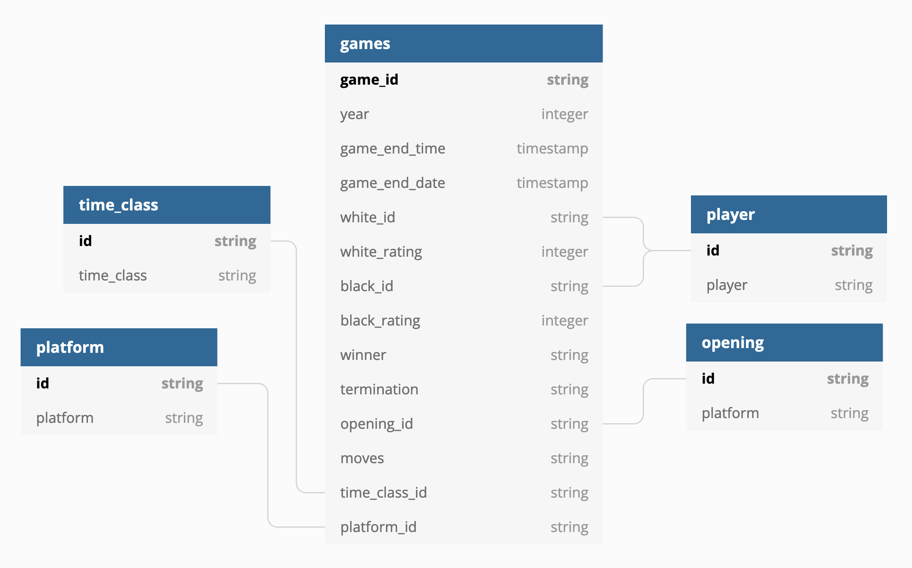
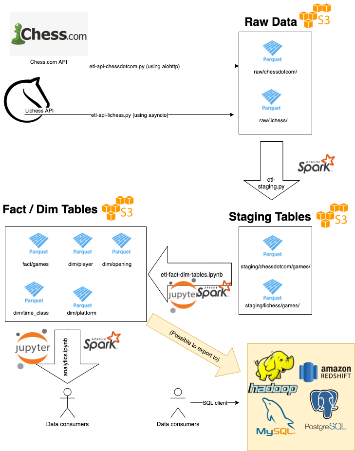
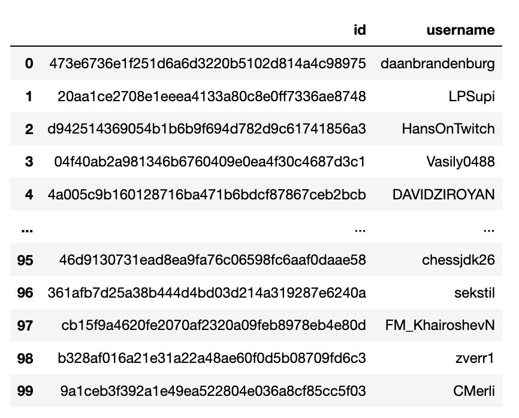
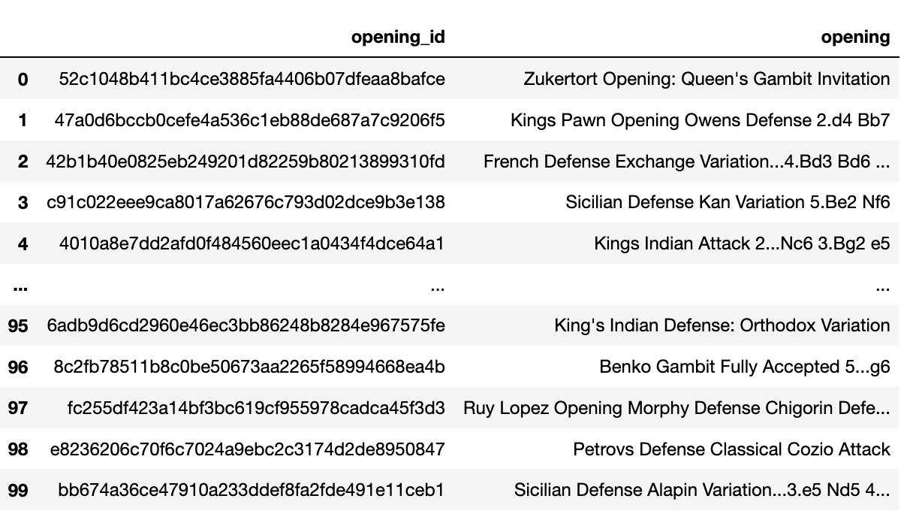
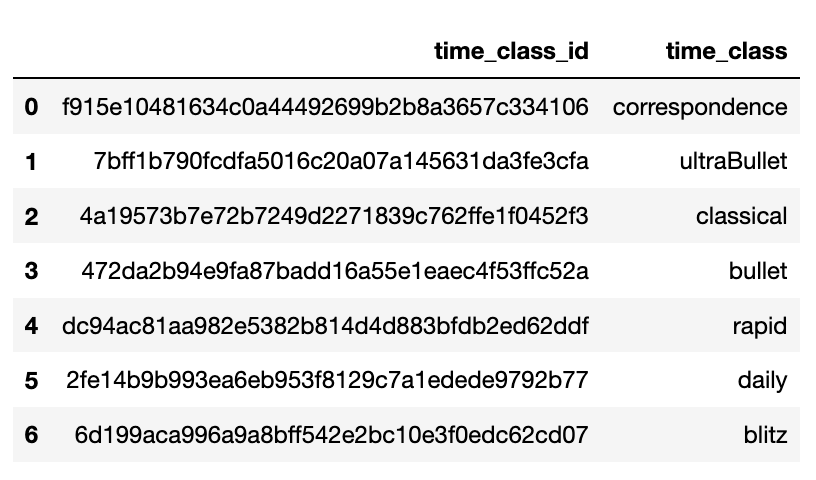
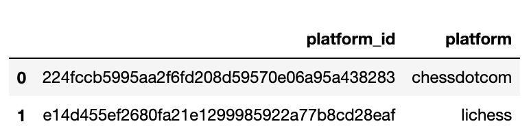

# Introduction

A part of the [Udacity Data Engineering Nanodegree](https://www.udacity.com/course/data-engineer-nanodegree--nd027), this [ETL](https://en.wikipedia.org/wiki/Extract,_transform,_load) project was developed as the DEND's Capstone Project. 

The aim of the project was to combine chess game data from from two popular chess website APIs:

1) [The Lichess.org API](https://lichess.org/api)
2) [The Chess.com API](https://www.chess.com/news/view/published-data-api) — via the `chessdotcom` [Python module](https://pypi.org/project/chess.com/)

— and thereby allow the creation of a custom bank of chess games, from both of the Internet's two most popular chess sites.

This project first pulls these data via the APIs that both sites offer and then performs ETL operations on these data using [Apache Spark](https://spark.apache.org/) ([PySpark](https://spark.apache.org/docs/latest/api/python/index.html)), moving these 1M+ rows from a collection of raw API responses to finally rendering them as fact/dim tables that display useful information.

During this process, data is saved at each stage in [Apache Parquet](https://parquet.apache.org/) format, as it has [a number of advantages over other file formats such as CSV](https://blog.openbridge.com/how-to-be-a-hero-with-powerful-parquet-google-and-amazon-f2ae0f35ee04), including being a columnar storage format. Throughout this process, data can be saved both locally, or to [Amazon S3](https://aws.amazon.com/s3/).

This project includes:
* At least 2 data sources ✅ (Chess.com and Lichess data)
* More than 1 million lines of data. ✅ (The combined Chess.com and Lichess staging tables have `1,047,618` rows.)
* At least two data sources/formats (csv, api, json) ✅ (API Responses are in JSON, but the Chess.com response contains a [PGN](https://en.wikipedia.org/wiki/Portable_Game_Notation) blob that we need to parse separately.)


# Data Model / Dictionary

The final data model includes one fact table:

1. `games` 

— and four dimension tables:

1. `player`
2. `opening`
3. `platform`
4. `time_class`

This allows a data consumer accessing this final data model to join these tables and run complex queries. For a few examples of such queries, see the `analytics.ipynb` notebook.

The ERD for final model looks like this:



And the ETL process diagram looks like this:



Below, we go into the different stages the data went through to arrive at this final state.

## 1) Raw JSON Responses 

### Lichess API JSON Response
The Lichess API endpoint we are using to get games (`https://lichess.org/api/games/user/{username}`) returns a JSON blob that looks like this:

```
{
   "id":"q7ZvsdUF",
   "rated":true,
   "variant":"standard",
   "speed":"blitz",
   "perf":"blitz",
   "createdAt":1514505150384,
   "lastMoveAt":1514505592843,
   "status":"draw",
   "players":{
      "white":{
         "user":{
            "name":"Lance5500",
            "title":"LM",
            "patron":true,
            "id":"lance5500"
         },
         "rating":2389,
         "ratingDiff":4
      },
      "black":{
         "user":{
            "name":"TryingHard87",
            "id":"tryinghard87"
         },
         "rating":2498,
         "ratingDiff":-4
      }
   },
   "opening":{
      "eco":"D31",
      "name":"Semi-Slav Defense: Marshall Gambit",
      "ply":7
   },
   "moves":"d4 d5 c4 c6 Nc3 e6 e4 Nd7 exd5 cxd5 cxd5 exd5 Nxd5 Nb6 Bb5+ Bd7 Qe2+ Ne7 Nxb6 Qxb6 Bxd7+ Kxd7 Nf3 Qa6 Ne5+ Ke8 Qf3 f6 Nd3 Qc6 Qe2 Kf7 O-O Kg8 Bd2 Re8 Rac1 Nf5 Be3 Qe6 Rfe1 g6 b3 Bd6 Qd2 Kf7 Bf4 Qd7 Bxd6 Nxd6 Nc5 Rxe1+ Rxe1 Qc6 f3 Re8 Rxe8 Nxe8 Kf2 Nc7 Qb4 b6 Qc4+ Nd5 Nd3 Qe6 Nb4 Ne7 Qxe6+ Kxe6 Ke3 Kd6 g3 h6 Kd3 h5 Nc2 Kd5 a3 Nc6 Ne3+ Kd6 h4 Nd8 g4 Ne6 Ke4 Ng7 Nc4+ Ke6 d5+ Kd7 a4 g5 gxh5 Nxh5 hxg5 fxg5 Kf5 Nf4 Ne3 Nh3 Kg4 Ng1 Nc4 Kc7 Nd2 Kd6 Kxg5 Kxd5 f4 Nh3+ Kg4 Nf2+ Kf3 Nd3 Ke3 Nc5 Kf3 Ke6 Ke3 Kf5 Kd4 Ne6+ Kc4",
   "clock":{
      "initial":300,
      "increment":3,
      "totalTime":420
   }
}
```

### Chess.com API JSON Response

The Lichess API endpoint we are using to get games (`https://api.chess.com/pub/player/{username}/games/{YYYY}/{MM}`) returns a JSON blob that looks like this:

```
{
  "white": { // details of the white-piece player:
    "username": "string", // the username
    "rating": 1492, // the player's rating at the start of the game
    "result": "string", // see "Game results codes" section
    "@id": "string", // URL of this player's profile
  },
  "black": { // details of the black-piece player:
    "username": "string", // the username
    "rating": 1942, // the player's rating at the start of the game
    "result": "string", // see "Game results codes" section
    "@id": "string", // URL of this player's profile
  },
  "url": "string", // URL of this game
  "fen": "string", // final FEN
  "pgn": "string", // final PGN
  "start_time": 1254438881, // timestamp of the game start (Daily Chess only)
  "end_time": 1254670734, // timestamp of the game end
  "time_control": "string", // PGN-compliant time control
  "rules": "string", // game variant information (e.g., "chess960")
  "eco": "string", //URL pointing to ECO opening (if available),
  "tournament": "string", //URL pointing to tournament (if available),  
  "match": "string", //URL pointing to team match (if available)  
}
```

These JSON blobs are flattened and then stored as `*.parquet` files in the `raw/` directory. The `pgn` field contains a [PGN](https://en.wikipedia.org/wiki/Portable_Game_Notation) blob that we need to parse separately in the `etl-staging-py.` script.

## 2) Staging Tables

From there, we use Spark SQL transformations in the the `etl-staging.py`  script to create a staging table each for Chess.com and Lichess data. 

Here, the Chess.com staging table has one extra column `rated` and several columns also have incorrect types. These issues are fixed when generating the fact and dimension tables in the next step of the ETL process.

### Chessdotcom Staging

```
root
 |-- game_end_time: string (nullable = true)
 |-- game_end_date: string (nullable = true)
 |-- time_class: string (nullable = true)
 |-- rated: boolean (nullable = true)
 |-- white_username: string (nullable = true)
 |-- white_rating: long (nullable = true)
 |-- black_username: string (nullable = true)
 |-- black_rating: long (nullable = true)
 |-- winner: string (nullable = true)
 |-- termination: string (nullable = true)
 |-- opening: string (nullable = true)
 |-- moves: string (nullable = true)
 |-- platform: string (nullable = true)
 ```

 ### Lichess Staging

 ```
 root
 |-- game_end_time: string (nullable = true)
 |-- game_end_date: string (nullable = true)
 |-- time_class: string (nullable = true)
 |-- white_username: string (nullable = true)
 |-- white_rating: double (nullable = true)
 |-- black_username: string (nullable = true)
 |-- black_rating: double (nullable = true)
 |-- winner: string (nullable = true)
 |-- termination: string (nullable = true)
 |-- opening: string (nullable = true)
 |-- moves: string (nullable = true)
 |-- platform: string (nullable = true)

 ```

## 3) `games` Fact Table

### Final Transformations

There is a difference in the number of columns between the two Chess.com / Lichess staging tables, for which reason we perform some final transformations in the `etl-fact-and-data-quality.py` script.

1) Removing the extra `rated` column in the the Chess.com staging table before we union the tables.
2) Creating an `id` column by hashing the `game_end_time`, `white_username` and `black_username` columns.
3) We also create the the following `*_id` columns using Spark SQL's [SHA1 hash function](https://spark.apache.org/docs/2.3.0/api/sql/index.html#sha1):

* `game_id` hashed from `game_end_time` + `white_username` + `black_username`
* `white_id` hashed from `white_username`
* `black_id` hashed from `black_username`
* `opening_id` hashed from `opening`
* `time_class_id` hashed from `time_class`
* `platform_id` hased from `platform`

4) We use PySpark's [dropDuplicates](https://spark.apache.org/docs/latest/api/python/reference/api/pyspark.sql.DataFrame.dropDuplicates.html) function to remove rows that have the same (SHA1 hashed) `game_id` column.


After we do this, select only the following columns when we ouput final `games` fact table:

```
root
 |-- game_id: string (nullable = true)
 |-- year: integer (nullable = true)
 |-- game_end_time: timestamp (nullable = true)
 |-- game_end_date: timestamp (nullable = true)
 |-- time_class_id: string (nullable = true)
 |-- white_id: string (nullable = true)
 |-- white_rating: integer (nullable = true)
 |-- black_id: string (nullable = true)
 |-- black_rating: integer (nullable = true)
 |-- winner: string (nullable = true)
 |-- termination: string (nullable = true)
 |-- opening_id: string (nullable = true)
 |-- moves: string (nullable = true)
 |-- platform_id: string (nullable = true)

```

When writing the `games` table to `*.parquet` files, we partition them by both `year` and `time_class_id`, the rationale being that in general we will want to query games of the same year togetherk and that we'd mostly be interested in comparing game data within each time class.

### Data Quality Checks

After joining the Chess.com and Lichess fact tables, we perform these data quality checks on the final fact table:

1) Use `.dropDuplicates()` on the `game_id` column to filter out any duplicate rows.
2) Use `cast()` to set the correct data types on `int` and `timestamp` columns such as `year`, `game_end_time`, `game_end_date`, `white_rating` and `black_rating` that may have been incorrect cast in the staging tables.


## 4) Dimension Tables

We then render these four dimension tables:

### Player Table



Currently contains a hashed `player_id` and player name, but in the future more columns could be added that contain biographical info and lifetime stats.

### Opening Table



Currently contains a hashed `opening_id` and opening name, but in the future more columns could be added that contain information such as [Chess ECO codes](https://www.365chess.com/eco.php).

### `Time Class Table



Contains a hashed `time_class_id` and time class name.

### Platform Table



Contains a hashed `platform_id` and platform name. Currently only contains `lichess` and `chessdotcom`  but more platforms could be added in the future.


# Files
```
- config/dl-lichess.yaml -- Lichess config file
- config/dl-chessdotcom.yaml -- Chess.com config file
- sql_queries.py -- The SQL queries module that is used by `etl-staging.py`
- images/erd.png - ERD image which is included in the README
- README.md -- this file
- etl-api-lichess.py -- script that fetches data from the Lichess API
- etl-api-chessdotcom.py -- script that fetches data from the Chess.com API
- etl-staging.py -- script that takes the raw API data and outputs a staging table for each chess site
- etl-fact-dim-tables.ipynb -- Jupyter notebook that unions the two staging tables and performs data quality checks before outputting the fact and dim tables
- analytics.ipynb -- Jupyter notebook that loads the fact and dim tables and runs analytics
```

# Setup 

## Setting up config files
In the `config/` directory, you will find a separate config file for each platform.

### Configuring AWS Access Key

You will need to configure both `config/dl-lichess.yaml` and `config/dl-chessdotcom.yaml` with your [AWS access key](https://docs.aws.amazon.com/general/latest/gr/aws-sec-cred-types.html) that allows you to connect to your S3 buckets.


### Lichess - `dl-lichess.yaml`

```
aws_access_key_id: 
aws_secret_key_id: 

output_data_path_local: local_data_dir/
output_data_path_s3: s3_bucket_name/

lichess_players:
- drnykterstein

max_games_per_player: ~
```

`lichess_players` is where you need to list the players whose chess game data you would like to collect via the `etl-api-lichess.py` script. The Lichess config file also has an extra `max_games_per_player` field which you can use to specify the number of games you would like to retrieve from each player. If left null (`~`), it will attempt to fetch all games that the player has played since their account creation.

### Chess.com - `dl-chessdotcom.yaml`

```
aws_access_key_id: 
aws_secret_key_id: 

output_data_path_local: local_data_dir/
output_data_path_s3: s3_bucket_name/

chessdotcom_players:
- magnuscarlsen
```

`chessdotcom_players` is where you need to list the players whose chess game data you would like to collect via the `etl-api-chessdotcom.py` script.

## `etl-api-*.py`

These two scripts do not require Spark to run. Instead, they fetch data from the API and write it out to `*.parquet` files using pandas. Here are the Python modules required by the two scripts:

`etl-api-chessdotcom.py` -- `chessdotcom`, `pyyaml`, `argparse`, `os`, `requests`, `json`, `s3fs`

`etl-api-lichess.py` -- `asyncio`, `flatten_json`, `pyyaml`, `argparse`, `os`, `requests`, `json`, `pathlib`, `s3fs`

Note: The `chessdotcom` script uses [the `chessdotcom` Python module](https://pypi.org/project/chess.com/), which uses [aiohttp](https://pypi.org/project/aiohttp/) for asynchronous web requests. The`lichess` script uses [`asyncio`](https://docs.python.org/3/library/asyncio.html) to implement async fetching manually.

## `etl-staging.py`

If you plan to run the `etl-staging.py` script on a Spark cluster such as [Amazon EMR](https://aws.amazon.com/emr/?whats-new-cards.sort-by=item.additionalFields.postDateTime&whats-new-cards.sort-order=desc), you will need to configure [a bootstrap script](https://docs.aws.amazon.com/emr/latest/ManagementGuide/emr-plan-bootstrap.html) that will install the required Python modules on your Spark worker nodes as well. Here is a sample bash script that you can use for this purpose:

```
#!/bin/bash

sudo python3 -m pip install argparse pyyaml pgn_parser 
```

Further, when you invoke`etl-staging.py` you will need to specify which platform to pull the raw data from. For Lichess, use:

`python etl-staging.py --platform lichess`

and for Chess.com use:

`python etl-staging.py --platform chessdotcom`

## Saving data locally vs on s3

Though both ETL API scripts (`etl-api-*.py`) and the ETL staging script (`etl-staging.py`) default to saving data on Amazon s3, they can also save data locally. To make this happen, pass in the `--local` flag to the script when you invoke it. For example:

`etl-api-chessdotcom.py --local`

# Tools and Technologies

## ETL API Scripts(`etl-api-*.py`) - `asyncio` and `aiohttp`

We chose to use the [asyncio](https://docs.python.org/3/library/asyncio.html) and [aiohttp](https://docs.aiohttp.org/en/stable/) functionality available in Python 3.3+ for these API scripts, as that asynchronicity is key when fetching data from APIs. We implemented `asyncio` manually for the Lichess script, but for the Chess.com script, `aiohttp` was already implemented in [the chessdotcom Python module](https://pypi.org/project/chess.com/) that we used. 

## ETL Staging Script and ETL Fact+Dim / Analytics Notebooks

Throughout the rest of the project, we use [Apache Spark](https://spark.apache.org/) for its superior distributed data processing capabilities and pair it with the [Apache Parquet](https://parquet.apache.org/) file format, which is a columnar storage format that is [both faster than other file formats like CSV, while also taking up less space on disk](https://www.upsolver.com/blog/apache-parquet-why-use).

This Spark + Parquet pairing also means that scaling the project up to handle 100x the data will be much easier as  well. More on that below.

## Updating the Data

This dataset is highly customisable, as the goal here was to allow the creation of a custom bank of chess games, from both of the Internet's two most popular chess sites. How often the data should be updated will depend on the use-case. For example:

a) If you were building a database of games for a particular player like Magnus Carlsen, you could fetch games from both their Lichess (`drnykterstein`) and Chess.com (`magnuscarlsen`) usernames and then set up automation using a tool like [Apache Airflow](https://airflow.apache.org/) to pull in their most recent games each day.

b) On the other hand, if you were looking to build a dataset of games from the year `2020`, you could specify the players you want to pull games from using the config files in the `config/` directory and then build and complete that dataset once and for all.

# Scaling
Here is how I would approach scaling:

> The data was increased by 100x.

The main ETL processes should still work fine:
a) Both `etl-api-*.py` make use of async http fetching and will be able to pull in more data if allocated more system resources. However, there is likely more optimization that can be done here to allow more concurrent connections and speed things up.

b) `etl-staging.py` on the other hand will easily scale up to match the resources available by the Spark cluster. With Spark doing the heavy lifting here in terms of resource allocation and management, there likely won't be many bottlenecks here in terms of the staging data that can be processed.

c) Finally, our two notebookes: `etl-fact-dim-tables.ipynb`  and `analytics.ipynb` use Spark as well, and as above, should have no trouble handling even 100x data, provided that the cluster was given enough resources to operate.

> The pipelines would be run on a daily basis by 7 am every day.

This kind of automation could be achieved by setting up an [Apache Airflow DAG](https://airflow.apache.org/docs/apache-airflow/stable/tutorial.html) that runs these ETL scripts at 7am each day.

> The database needed to be accessed by 100+ people.

Given that we save `*.parquet` files to s3 each day, at any stage of the process these files can be moved into [Amazon Redshift](https://aws.amazon.com/redshift/) via its convenient [COPY functionality](https://aws.amazon.com/about-aws/whats-new/2018/06/amazon-redshift-can-now-copy-from-parquet-and-orc-file-formats/). Since `*.parquet` files are widely supported in the [Apache Hadoop ecosystem](https://hadoop.apache.org/) they can also be loaded directly into many other database systems.

This loading could be automated using Airflow DAGs as well and once these data are in a RDMBS, they could be simultaneously accessible by hundreds and even thousands of users.